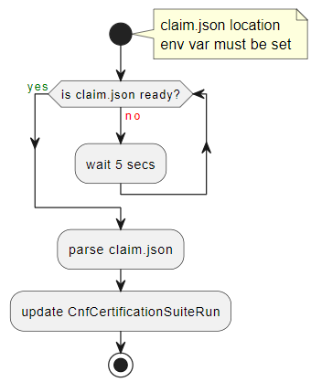
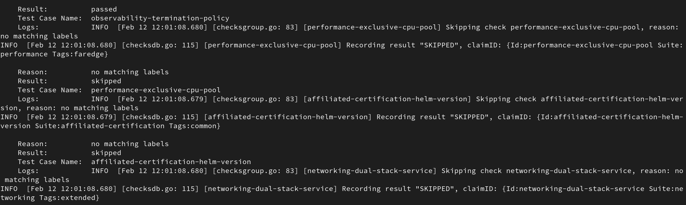

# CNF Certification Suite Operator

[](https://www.redhat.com)
[](https://www.redhat.com/en/technologies/cloud-computing/openshift)

## Description

Kubernetes/Openshift Operator (scaffolded with operator-sdk) running the
[CNF Certification Suite Container](https://github.com/test-network-function/cnf-certification-test).

The CNF Certification Suites provide a set of test cases for the
Containerized Network Functions/Cloud Native Functions (CNFs) to verify if
best practices for deployment on Red Hat OpenShift clusters are followed.

### How does it work?

The Operator uses a CR representing a CNF Certification Suites run.
In order to run the suites, such "run" CR has to be created together
with a Config Map containing the cnf certification suites configuration,
and a Secret containing the preflight suite credentials.\

See resources relationship diagram:


When the CR is deployed, a new pod with two containers is created:

1. Container built with the cnf certification image in order to run the suites.
2. Container which creates a new CR representing the CNF Certification suites
results based on results claim file created by the previous container.

    See container's flow in the following diagram:

    

**See diagram summarizing the process:**


## Getting Started

You’ll need a Kubernetes cluster to run against.
You can use [KIND](https://sigs.k8s.io/kind) to get a local cluster for testing,
or run against a remote cluster.
**Note:** Your controller will automatically use the current context in your
kubeconfig file (i.e. whatever cluster `kubectl cluster-info` shows).

### Install operator

1. Clone Cnf Certification Operator repo:

    ```sh
    git clone https://github.com/greyerof/tnf-op.git
    ```

    (Note: temporary repo's URL)

2. Build the operator image under `IMG` name:

    ```sh
    make build-docker IMG=quay.io/testnetworkfunction/cnf-certsuite-operator:<tag>
    ```

3. Deploy the controller to the cluster with the image specified by `IMG`:

    ```sh
    make deploy IMG=quay.io/testnetworkfunction/cnf-certsuite-operator:<tag>
    ```

### Test it out

Use our samples to test out the cnf certification operator, with the following steps:

1. In `config/samples/kustomization.yaml` uncomment the following lines:

    ```sh
    - extra/cnf-certsuite-configmap.yaml
    - extra/cnf-certsuite-preflight-secret.yaml
    ```

2. Create the sample resources:

    ```sh
    oc kustomize ./config/samples/ | oc apply -f -
    ```

### Running test suites on the cluster

1. Create Resources

    In order to use the cnf certification suite operator,
    you'll have to create yaml files for the following resources:

    1. Config map:\
    Containing the cnf certification configuration file
    content under the `tnf_config.yaml` key.\
    (see [CNF Certification configuration description](https://test-network-function.github.io/cnf-certification-test/configuration/))

    2. Secret:\
    Containing cnf preflight suite credentials
    under the `preflight_dockerconfig.json` key.\
    (see [Preflight Integration description](https://test-network-function.github.io/cnf-certification-test/runtime-env/#disable-intrusive-tests))

    3. CnfCertificationSuiteRun CR:\
    Containing the following Spec fields that has to be filled in:
        - **labelsFilter**: Wanted label filtering the cnf certification tests suite.
        - **logLevel**: Wanted log level of cnf certification tests suite run.
        - **timeout**: Wanted timeout for the the cnf certification tests.
        - **configMapName**: Name of the config map defined at stage 1.
        - **preflightSecretName**: Name of the preflight Secret
        defined at stage 2.
        - **enableDataCollection**: Set to "true" to enable data collection,
        or "false" otherwise\
        **Note:** Current operator's version **doesn't** support
        setting enableDataCollection to "true".

        See a [sample CnfCertificationSuiteRun CR](https://github.com/greyerof/tnf-op/blob/main/config/samples/cnf-certifications_v1alpha1_cnfcertificationsuiterun.yaml)

    **Note:** All resources have to be defined
    under the `cnf-certsuite-operator` namespace.

2. Apply resources into the cluster

    After creating all the yaml files for required resources,
    use the following commands to apply them into the cluster:

    ```sh
    oc apply -f /path/to/config/map.yaml
    oc apply -f /path/to/preflight/secret.yaml
    oc apply -f /path/to/cnfCertificationSuiteRun.yaml
    ```

    **Note**: The same config map and secret can be reused
    by different CnfCertificationSuiteRun CR's.

### Review results

If all of the resources were applied successfully, the cnfcertification suites
will run on a new created `pod` in the `cnf-certsuite-operator` namespace.

When the pod is completed, a new `CnfCertificationSuiteReport` will be created
under the same namespace.
CNF certification suites results will be stored in the CR's Status different fields:

- Results: For every test case, contains its result and logs.
If the the result is "skipped" or "failed" contains also the skip\failure reason.

    See example:

    

- Summary: Summarize the total number of tests by their results.
- Verdict: Specifies the overall result of the CNF certificattion suites run.

Run the following command to ensure its creation:

```sh
oc get cnfcertificationsuitereports.cnf-certifications.redhat.com -n cnf-certsuite-operator
```

To review the test results describe the created
`CnfCertificationSuiteReport` run the following command:

```sh
oc describe cnfcertificationsuitereports.cnf-certifications.redhat.com \
-n cnf-certsuite-operator <report`s name>
```

### Uninstall CRDs

To delete the CRDs from the cluster:

```sh
make uninstall
```

### Undeploy controller

UnDeploy the controller from the cluster:

```sh
make undeploy
```

**NOTE:** Run `make --help` for more information on all potential `make` targets

More information can be found via the [Kubebuilder Documentation](https://book.kubebuilder.io/introduction.html)

## License

Copyright 2023.

Licensed under the Apache License, Version 2.0 (the "License");
you may not use this file except in compliance with the License.
You may obtain a copy of the License at

```plaintext
http://www.apache.org/licenses/LICENSE-2.0
```

Unless required by applicable law or agreed to in writing, software
distributed under the License is distributed on an "AS IS" BASIS,
WITHOUT WARRANTIES OR CONDITIONS OF ANY KIND, either express or implied.
See the License for the specific language governing permissions and
limitations under the License.
