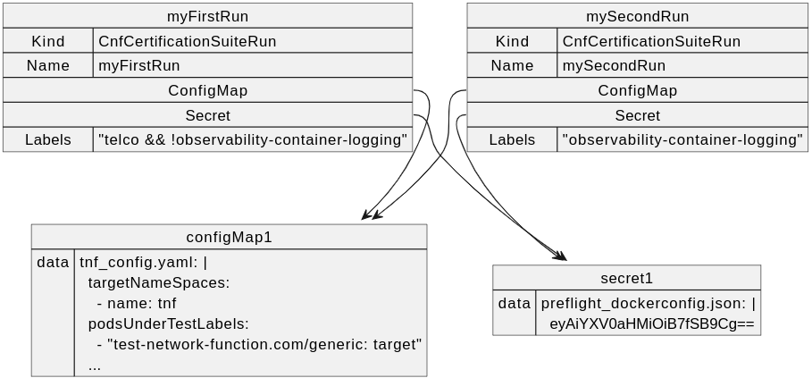
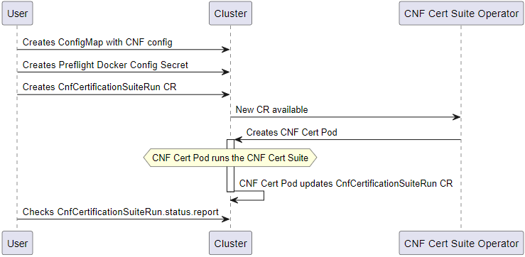

# CNF Certification Suite Operator

[](https://www.redhat.com)
[](https://www.redhat.com/en/technologies/cloud-computing/openshift)

## Description

Kubernetes/Openshift Operator (scaffolded with operator-sdk) running the
[CNF Certification Suite Container](https://github.com/test-network-function/cnf-certification-test).

The CNF Certification Suites provide a set of test cases for the
Containerized Network Functions/Cloud Native Functions (CNFs) to verify if
best practices for deployment on Red Hat OpenShift clusters are followed.

### How does it work?

The Operator registers a CRD in the cluster: `CnfCertificationSuiteRun`.

In order to fire up the CNF Certification Suite, the user must create
a CnfCertificationSuiteRun CR, also informally referred as Run CR, which
has to be created with a Config Map containing the cnf certification suites configuration,
and a Secret containing the preflight suite credentials.
**Note:** All resources mentioned above should be created in the operator's
installation namespace (by default `cnf-certsuite-operator`)

See resources relationship diagram:



When the CR is deployed, a new pod with two containers is created:

1. Container built with the cnf certification image in order to run the suites.
2. Container (sidecar) which updates the Run CR's status fields containing the
CNF Certification suites results based on results claim file created by the
previous container.

**See diagram summarizing the process:**



## Getting Started

You’ll need a Kubernetes cluster to run against.
You can use [KIND](https://sigs.k8s.io/kind) to get a local cluster for testing,
or run against a remote cluster.
**Note:** Your controller will automatically use the current context in your
kubeconfig file (i.e. whatever cluster `kubectl cluster-info` shows).

### Install operator

#### Initial steps

1. Clone Cnf Certification Operator repo:

    ```sh
    git clone https://github.com/greyerof/tnf-op.git
    ```

2. Install cert-manager:

    ```sh
    kubectl apply -f https://github.com/jetstack/cert-manager/releases/latest/download/cert-manager.yaml
    ```

#### Option 1: Use a your own registry account

1. Export images environment variables:

    ```sh
    export IMG=<your-registry.com>/<your-repo>/cnf-certsuite-operator:<version>
    export SIDECAR_IMG=<your-registry.com>/<your-repo>/cnf-certsuite-operator-sidecar:<version>
    ```

2. Build and upload the controller image to your registry account:

    ```sh
    make docker-build docker-push
    ```

3. Build and upload the side car image to your registry account:

    ```sh
    docker build -f cnf-cert-sidecar/Dockerfile -t $SIDECAR_IMG .
    docker push $SIDECAR_IMG
    ```

4. Deploy the operator, using the previously uploaded controller image,
 and the built side car image:

    ```sh
    make deploy
    ```

#### Option 2: Use local images

1. Export images environment variables (optional):

    ```sh
    export IMG=<your-cnf-certsuite-operator-image-name>
    export SIDECAR_IMG=<your-sidecar-app-image-name>
    ```

    **Note**: if the images aren't provided,
    scripts of next steps will use default images:

    ```sh
    IMG=ci-cnf-op:v0.0.1-test
    SIDECAR_IMG=ci-cnf-op-sidecar:v0.0.1-test
    ```

2. Build controller and side car images:

    ```sh
    scripts/ci/build.sh
    ```

3. Deploy previously built images by preloading them into the kind cluster's nodes:

    ```sh
    scripts/ci/deploy.sh
    ```

### Test it out

Use our samples to test out the cnf certification operator, with the following command:

```sh
make deploy-samples
```

**Note**: Current sample CnfCertificationSuiteRun CR configures
the CNF Certification Suite to run the "observability" test suite only.
It can be modified by changing manually the `labelsFilter` of the [sample CR](https://github.com/greyerof/tnf-op/blob/main/config/samples/cnf-certifications_v1alpha1_cnfcertificationsuiterun.yaml).

### How to customize the CNF Certification Suite run

1. Create Resources

    In order to use the cnf certification suite operator,
    you'll have to create yaml files for the following resources:

    1. Config map:\
    Containing the cnf certification configuration file
    content under the `tnf_config.yaml` key.\
    (see [CNF Certification configuration description](https://test-network-function.github.io/cnf-certification-test/configuration/))

    2. Secret:\
    Containing cnf preflight suite credentials
    under the `preflight_dockerconfig.json` key.\
    (see [Preflight Integration description](https://test-network-function.github.io/cnf-certification-test/runtime-env/#disable-intrusive-tests))

    3. CnfCertificationSuiteRun CR:\
    Containing the following Spec fields that has to be filled in:
        - **labelsFilter**: Wanted label filtering the cnf certification tests suite.
        - **logLevel**: Wanted log level of cnf certification tests suite run.\
        Log level options: "info", "debug", "warn", "error"
        - **timeout**: Wanted timeout for the the cnf certification tests.
        - **configMapName**: Name of the config map defined at stage 1.
        - **preflightSecretName**: Name of the preflight Secret
        defined at stage 2.
        - **enableDataCollection**: Set to "true" to enable data collection,
        or "false" otherwise\
        **Note:** Current operator's version **doesn't** support
        setting enableDataCollection to "true".

        See a [sample CnfCertificationSuiteRun CR](https://github.com/greyerof/tnf-op/blob/main/config/samples/cnf-certifications_v1alpha1_cnfcertificationsuiterun.yaml)

2. Apply resources into the cluster

    After creating all the yaml files for required resources,
    use the following commands to apply them into the cluster:

    ```sh
    oc apply -f /path/to/config/map.yaml
    oc apply -f /path/to/preflight/secret.yaml
    oc apply -f /path/to/cnfCertificationSuiteRun.yaml
    ```

    **Note**: The same config map and secret can be reused
    by different CnfCertificationSuiteRun CR's.

### Review results

If all of the resources were applied successfully, the cnf certification suites
will run on a new created `pod` in the `cnf-certsuite-operator` namespace.
The pod has the name with the form `cnf-job-run-N`:

<!-- markdownlint-disable -->
```sh
$ oc get pods -n cnf-certsuite-operator 
NAME                                                READY   STATUS      RESTARTS   AGE
cnf-certsuite-controller-manager-6c6bb6d965-jslmd   2/2     Running     0          21h
cnf-job-run-1                                       0/2     Completed   0          21h
```
<!-- markdownlint-enable -->

Check whether the pod creation and the cnf certification suites run were successful
by checking CnfCertificationSuiteRun CR's status.
In the successful case, expect to see the following status:

```sh
$ oc get cnfcertificationsuiteruns.cnf-certifications.redhat.com -n cnf-certsuite-operator
NAME                              AGE   STATUS
cnfcertificationsuiterun-sample   50m   CertSuiteFinished
```

The status `CertSuiteFinished` means the CNF Cert Suite pod has finished running
all the test cases, so the results can be inspected in field `report` of the Run
CR's (cnfcertificationsuiterun-sample) status subresource.

- Results: For every test case, contains its result and logs.
If the the result is "skipped" or "failed" contains also the skip\failure reason.

    See example:

    <!-- markdownlint-disable -->
    ```sh
    status:
       report:
            results:
                - logs: |
                    INFO  [Feb 15 13:05:50.749] [check.go: 263] [observability-pod-disruption-budget] Running check (labels: [common observability-pod-disruption-budget observability])
                    INFO  [Feb 15 13:05:50.749] [suite.go: 193] [observability-pod-disruption-budget] Testing Deployment "deployment: test ns: tnf"
                    INFO  [Feb 15 13:05:50.749] [suite.go: 206] [observability-pod-disruption-budget] PDB "test-pdb-min" is valid for Deployment: "test"
                    INFO  [Feb 15 13:05:50.749] [suite.go: 224] [observability-pod-disruption-budget] Testing StatefulSet "statefulset: test ns: tnf"
                    INFO  [Feb 15 13:05:50.749] [suite.go: 237] [observability-pod-disruption-budget] PDB "test-pdb-max" is valid for StatefulSet: "test"
                    INFO  [Feb 15 13:05:50.749] [checksdb.go: 115] [observability-pod-disruption-budget] Recording result "PASSED", claimID: {Id:observability-pod-disruption-budget Suite:observability Tags:common}
                    result: passed
                    testCaseName: observability-pod-disruption-budget
                - logs: |
                    INFO  [Feb 15 13:05:50.723] [checksgroup.go: 83] [operator-install-source] Skipping check operator-install-source, reason: no matching labels
                    INFO  [Feb 15 13:05:50.723] [checksdb.go: 115] [operator-install-source] Recording result "SKIPPED", claimID: {Id:operator-install-source Suite:operator Tags:common}
                    reason: no matching labels
                    result: skipped
                    testCaseName: operator-install-source
                - logs: |
                    INFO  [Feb 15 13:05:50.749] [checksgroup.go: 83] [affiliated-certification-helmchart-is-certified] Skipping check affiliated-certification-helmchart-is-certified, reason: no matching labels
                    INFO  [Feb 15 13:05:50.749] [checksdb.go: 115] [affiliated-certification-helmchart-is-certified] Recording result "SKIPPED", claimID: {Id:affiliated-certification-helmchart-is-certified Suite:affiliated-certification Tags:common}
                    reason: no matching labels
                    result: skipped
                    testCaseName: affiliated-certification-helmchart-is-certified
    ```
    <!-- markdownlint-enable -->

- Summary: Summarize the total number of tests by their results.
- Verdict: Specifies the overall result of the CNF certificattion suites run.\
Poissible verdicts: "pass", "skip", "fail", "error".

Run the following command to ensure its creation:

<!-- markdownlint-disable -->
```sh
$ oc get cnfcertificationsuiteruns.cnf-certifications.redhat.com -n cnf-certsuite-operator cnfcertificationsuiterun-sample -o json | jq '.status.report.verdict'
"pass"
```
<!-- markdownlint-enable -->

### Uninstall CRDs

To delete the CRDs from the cluster:

```sh
make uninstall
```

### Undeploy controller

UnDeploy the controller from the cluster:

```sh
make undeploy
```

**NOTE:** Run `make --help` for more information on all potential `make` targets

More information can be found via the [Kubebuilder Documentation](https://book.kubebuilder.io/introduction.html)

## License

Copyright 2023.

Licensed under the Apache License, Version 2.0 (the "License");
you may not use this file except in compliance with the License.
You may obtain a copy of the License at

```plaintext
http://www.apache.org/licenses/LICENSE-2.0
```

Unless required by applicable law or agreed to in writing, software
distributed under the License is distributed on an "AS IS" BASIS,
WITHOUT WARRANTIES OR CONDITIONS OF ANY KIND, either express or implied.
See the License for the specific language governing permissions and
limitations under the License.
